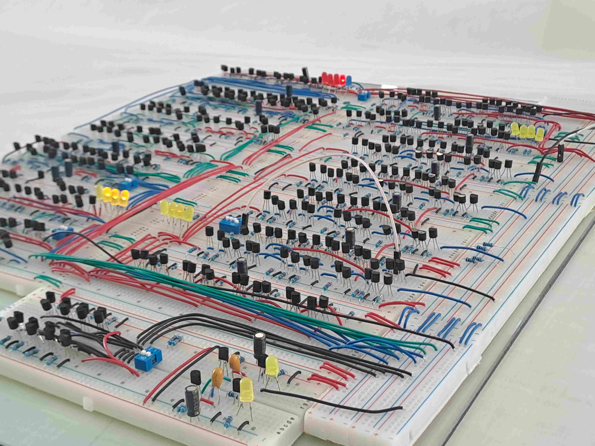

# 4-Bit Discrete Transistor ALU

While my computer engineering degree provides a strong theoretical foundation, my real learning happens hands-on. I built a functional 4-bit CPU entirely from scratch using 404 discrete NPN transistors, and I have designed custom IO boards using KiCad. I actively seek out and enjoy tackling complex, ground-up hardware challenges.

## The Hardware Reality
Building logic gates from raw physical components introduced electrical engineering challenges that do not exist in software simulations:
*   **The Build:** Constructed using 404 discrete transistors and over 30 meters of wiring on standard breadboards. No ICs were allowed for logic computation
*   **Power & Thermal Management:** At peak operation, the computer drew roughly 10 Amps. Distributing this load required multiple power connections to prevent the breadboards from melting
*   **Physical Debugging:** Required navigating microscopic faults, loose jumper wires, ground loops, and inductive kickback

## Architecture & Deep Dives

Click the links below to explore som of the documentation, schematics, and debugging logs for each specific module of the CPU:

### Arithmetic Logic Unit (ALU)
*   ➡️ **[Logic Gates](docs/Logic_Gates.md):** The fundamental building blocks (AND, NAND, XOR, OR, Buffers) constructed entirely from discrete transistors
*   ➡️ **[The Adder](docs/The_Adder.md):** The 4-Bit Ripple Carry Adder built from chained Full Adders and Half Adders
*   ➡️ **[The Two's Complement Generator](docs/Twos_Complement_Generator.md):** How the system handles subtraction using programmable XOR inverters and carry-in logic
*   ➡️ **[ALU Tri-State Buffers](docs/ALU_Tri_State_Buffers.md):** The open-collector buffers that prevent catastrophic short circuits on the shared data bus
*   ➡️ **[Possible ALU Additions](docs/Possible_ALU_Additions.md):** Future implementation concepts, including the Zero Flag and routing logic

### Control & Storage
*   ➡️ **[Registers](docs/Registers.md):** The Gated D-Latches used for general storage, and the Master-Slave Data Flip-Flops used for the Accumulator
*   ➡️ **[Clock](docs/Clock.md):** The timing system, specifically utilizing Falling Edge triggering to safely bypass the ALU's ripple delay
*   ➡️ **[Memory](docs/Memory.md):** The 2-nibble (10-byte architecture) storage system and its integration with the data bus

### Project Review
*   ➡️ **[Reflection & Upgrades](docs/Reflection_and_Upgrades.md):** Hardware debugging logs, power constraints, and functional upgrades like a hardware bit shifter and an interactive input port
