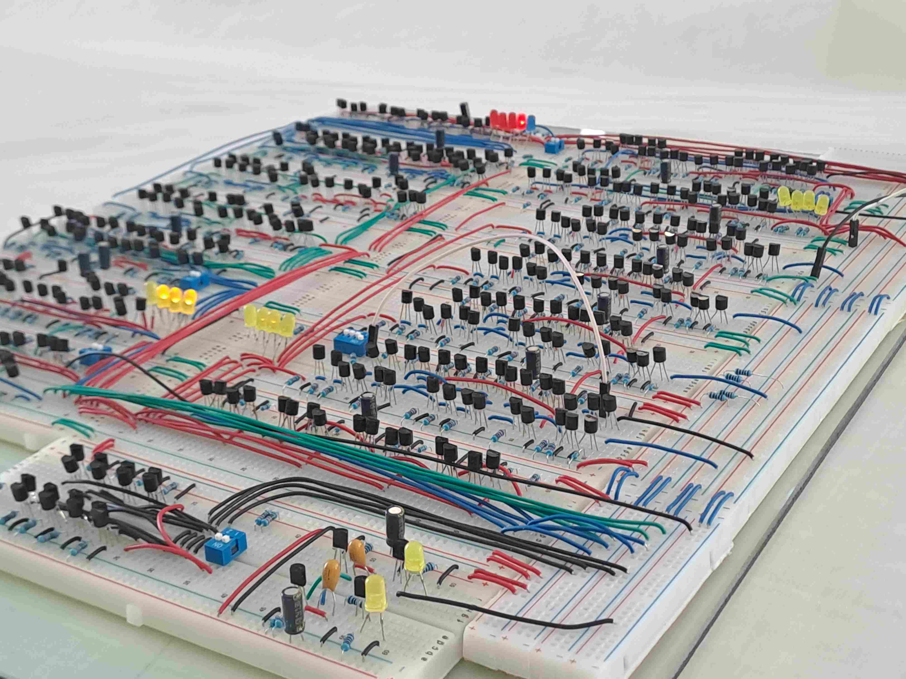

# 4-Bit Discrete Transistor ALU

This logbook documents my journey building a functional 4-bit ALU entirely from scratch using 404 discrete NPN transistors (completely free of integrated circuits for logic computation).
Heavily inspired by the detailed schematics and instructional videos of the [Global Science Network](https://www.youtube.com/@GlobalScienceNetwork), this document serves as a raw, ground-up record of my notes, design decisions, and debugging logs. It is a working reference of practical engineering challenges, kept intentionally unpolished to capture the authentic, iterative process of bringing complex hardware to life.

## The Hardware Reality
Building logic gates from raw physical components introduced numerous electrical engineering challenges:
*   **The Build:** Constructed using 404 discrete transistors and over 30 meters of wiring on standard breadboards. No ICs were allowed for logic computation
*   **Power and Breadboard Limitations:** At peak operation, the computer drew immense current. Distributing this load required multiple power connections to prevent the breadboards from melting. The breadboards also introduced parasitic elements and high-resistance mechanical terminations that needed to be overcome.
*   **Physical Debugging:** Required navigating microscopic faults, loose jumper wires, ground loops, inductive kickback and more.

## Architecture & Deep Dives

Click the links below to explore some of the documentation, schematics, and debugging logs for each specific module of the ALU:

### Arithmetic Logic Unit (ALU)
*   **[Logic Gates](docs/Logic_Gates.md):** The fundamental building blocks (AND, NAND, XOR, OR, Buffers) constructed entirely from discrete transistors
*   **[The Adder](docs/The_Adder.md):** The 4-Bit Ripple Carry Adder built from chained Full Adders and Half Adders
*   **[The Two's Complement Generator](docs/Twos_Complement_Generator.md):** How the system handles subtraction using programmable XOR inverters and carry-in logic
*   **[ALU Tri-State Buffers](docs/ALU_Tri_State_Buffers.md):** The open-collector buffers that prevent catastrophic short circuits on the shared data bus

### Control & Storage
*   **[Registers](docs/Registers.md):** The Gated D-Latches used for general storage, and the Master-Slave Data Flip-Flops used for the Accumulator
*   **[Clock](docs/Clock.md):** The timing system, specifically utilizing Falling Edge triggering to safely bypass the ALU's ripple delay
*   **[Memory](docs/Memory.md):** The 2-nibble (10-byte architecture) storage system and its integration with the data bus

### Project Review
*   **[Final Product & Reflection](docs/Final_Product_And_Reflection.md):** Hardware debugging logs, final product, and reflection on the building process and the future.
