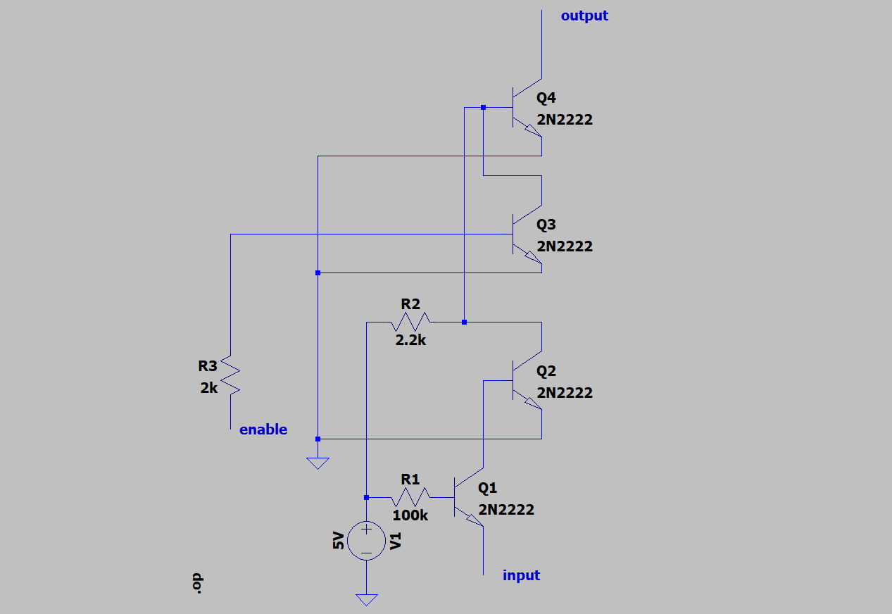
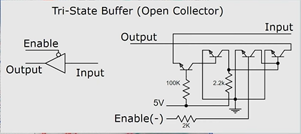

## ALU TRI-STATE BUFFERS

| Enable Pin   | Data Input | Output Voltage | Logic State               |
| ------------ | ---------- | -------------- | ------------------------- |
| **5V** (OFF) | Any        | **5V**         | **High-Z** (Disconnected) |
| **0V** (ON)  | 0V         | **5V**         | **Logic 1** (Disconnected) |
| **0V** (ON)  | 5V         | **16.9 mV**     | **Logic 0** (Grounded)     |

- 16.9mV found according to LTSpice

- **Logic 1:** The gate connects the wire directly to **5V**. (Strong push).
- **Logic 0:** The gate connects the wire directly to **Ground**. (Strong pull).

- Note Enable is inverted, thus when it is low, the tri-state buffer is enabled and if it is high, the tri state buffer is disabled (hence the output will always be High-Z if disabled)
- Tri state buffer connect to bus to ground for a 0 and disnonnect(high z) when other modules connect to the bus.
- All data lines's initial state is on, because of pullup resitors connected(thus providing a path to ground turns the data line off)
- Imagine the Adder tries to output a **1** (pushing **5V**).
- Imagine the RAM is also connected and tries to output a **0** (pulling to **Ground**).
- **Result:** A direct short circuit from 5V to Ground. Sparks fly. Transistors burn.
    
To prevent this explosion, you never connect the Adder directly to the Bus. You place a **Buffer** (specifically a Tri-State or Open-Collector Buffer) in between.

This Buffer translates the Adder's "Voltage" into the Bus's "Grounding Language."

- **If Adder says "1" (5V):**
    
    - The Buffer **disconnects** (floats).
    - It effectively cuts the wire.
    - The Bus's _own_ Pull-Up Resistor pulls the line to 5V.
        
    - _Result:_ Bus sees 1. Safe.
        
- **If Adder says "0" (0V):**
    
    - The Buffer turns ON a switch to **Ground**.
    - It pulls the Bus wire down to 0V.
        
    - _Result:_ Bus sees 0. Safe.
        

- possible short circuit for output bits 4 and -8 on bus, either all or none switch on, 
- I used the multimeter and confirmed there is continuity between the two bits, now we just need to find the short by isolation and process of elimination
- the bus of the last two bits melted,probably because of loose conenction from jumper cables, problem looks solved if i use the solid core wiring.

---

