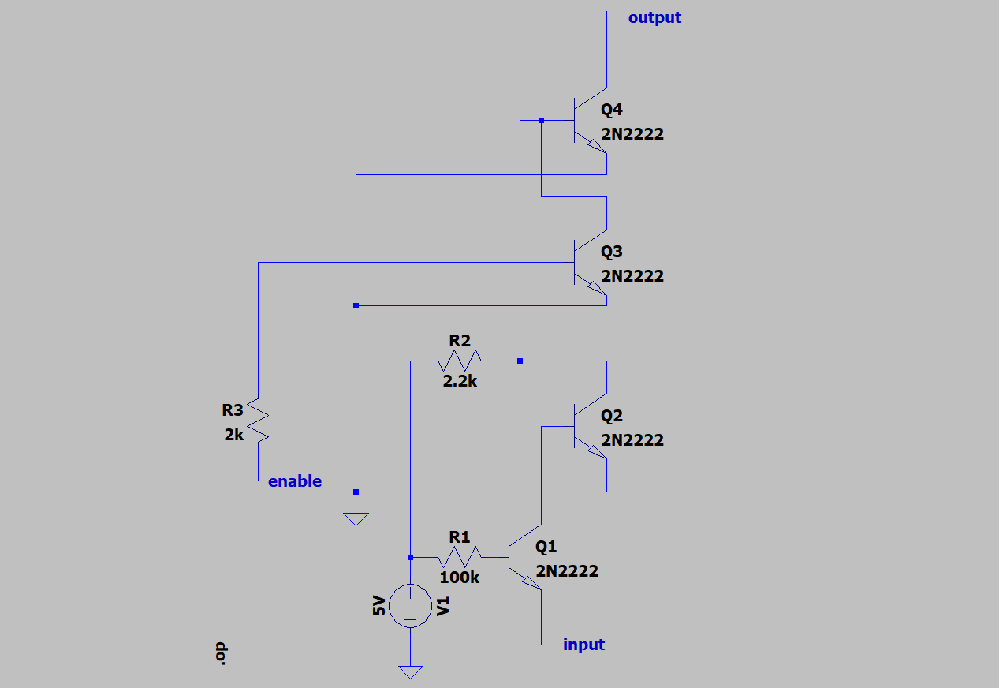
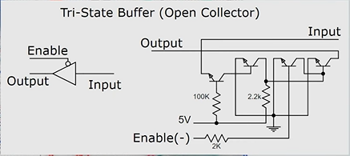

## ALU TRI-STATE BUFFERS & Bus Architecture

The Arithmetic Logic Unit (ALU) interfaces with the shared system bus using active-low, open-collector buffers. This architecture provides high-impedance isolation when disabled, preventing catastrophic bus contention and ensuring deterministic logic levels across all connected modules.

---
### Bus Contention & Open-collector Architecture

Connecting multiple modules (such as the ALU and Accumulator Register) directly to a shared bus using, for example, push-pull outputs introduces severe hardware risk:

- **Bus Contention:** If Module A outputs a high state ($5\text{ V}$) while Module B simultaneously asserts a low state ($0\text{ V}$), a dead short from power to ground occurs. The resulting overcurrent spike destroys output transistors and collapses rail voltages.
- **Open-Collector Solution:** Instead of actively sourcing $5\text{ V}$, the buffer only actively sinks current to ground (**Logic 0**) or floats entirely (**High-Z**).
- **Passive Bus Pull-Ups:** Dedicated pull-up resistors on the shared bus define the default quiescent state at $5\text{ V}$ (**Logic 1**). A module transmits by releasing the line to float high or clamping it to ground.

In this ALU active-low, open-collector inverting tri-state buffers were used to connect each module to the bus.
- *Active Low control:* Buffer enables when control pin is driven to 0V `ON` and disables when pulled to 5V `OFF`
- *Inverting Data action*: When enabled an 

### ALU Tri-State Buffer (Active-Low, Inverting)

| Enable Pin | Data Input | Output Voltage | Logic State | Bus Drive Mode |
| :--- | :--- | :--- | :--- | :--- |
| **5V (Disabled)** | Any | 5.0 V | **High-Z** | Disconnected (Passive Pull-Up) |
| **0V (Enabled)**  | 0 V | 5.0 V | **Logic 1** | Inverted Output (Pulled High) |
| **0V (Enabled)**  | 5 V | 16.9 mV | **Logic 0** | Inverted Output (Actively Sunk to GND) |

- 16.9mV found according to LTSpice

- **Logic 1:** The gate connects the wire directly to **5V**. (Strong push).
- **Logic 0:** The gate connects the wire directly to **Ground**. (Strong pull).

- Note Enable is inverted, thus when it is low, the tri-state buffer is enabled and if it is high, the tri state buffer is disabled (hence the output will always be High-Z if disabled)
- Tri state buffer connect to bus to ground for a 0 and disnonnect(high z) when other modules connect to the bus.
- All data lines's initial state is on, because of pullup resitors connected(thus providing a path to ground turns the data line off)
- Imagine the Adder tries to output a **1** (pushing **5V**).
- Imagine the RAM is also connected and tries to output a **0** (pulling to **Ground**).
- **Result:** A direct short circuit from 5V to Ground. Sparks fly. Transistors burn.
    
To prevent this explosion, you never connect the Adder directly to the Bus. You place a **Buffer** (specifically a Tri-State or Open-Collector Buffer) in between.

This Buffer translates the Adder's "Voltage" into the Bus's "Grounding Language."

- **If Adder says "1" (5V):**
    
    - The Buffer **disconnects** (floats).
    - It effectively cuts the wire.
    - The Bus's _own_ Pull-Up Resistor pulls the line to 5V.
        
    - _Result:_ Bus sees 1. Safe.
        
- **If Adder says "0" (0V):**
    
    - The Buffer turns ON a switch to **Ground**.
    - It pulls the Bus wire down to 0V.
        
    - _Result:_ Bus sees 0. Safe.
        

- possible short circuit for output bits 4 and -8 on bus, either all or none switch on, 
- I used the multimeter and confirmed there is continuity between the two bits, now we just need to find the short by isolation and process of elimination
- the bus of the last two bits melted,probably because of loose conenction from jumper cables, problem looks solved if i use the solid core wiring.

 ➡️ **[Registers](../docs/Registers.md):** 
 
---

