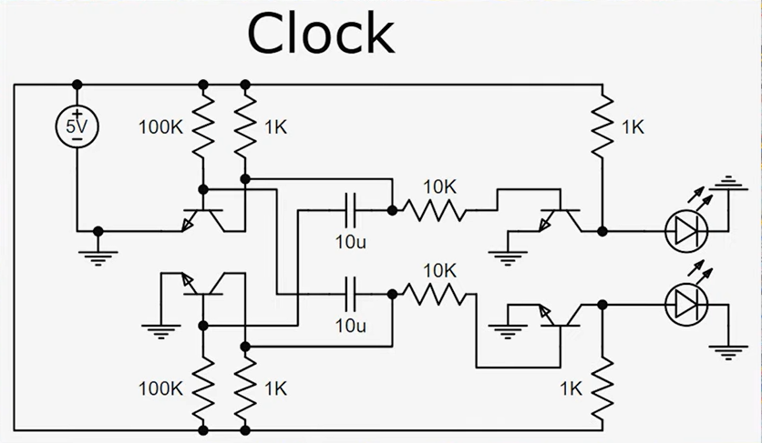

## Clock

  

  

 > ### Error Log: Bit 4 gave same output as clock
>
> **Issue:**  I used a jumper wire for Ground but it didn't make a good connection. I swapped it with a solid-core wire and this fixed the issue.
---

