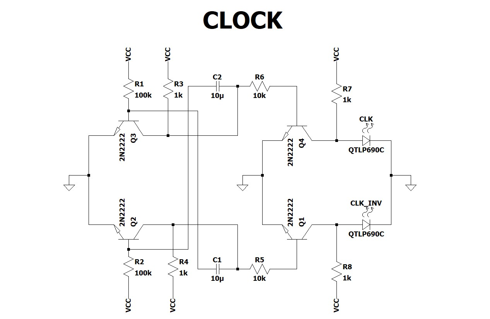
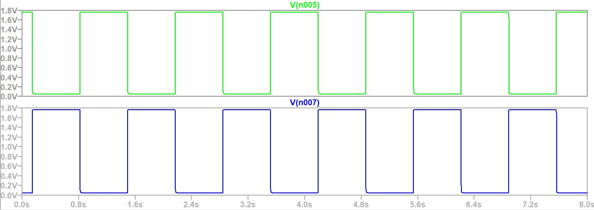

## Clock

  

The Green wave indicates the `CLK` Output, while the Blue wave indicates the inverted `CLK_INV` output. The simulations indicate a period of 1.34s (0.74Hz) and a 50% duty cycle. This low Hz was chosen for easy debugging during the final stages of assembly.

  

 > ### Error Log: Bit 4 gave same output as clock
>
> **Issue:**  I used a jumper wire for Ground but it didn't make a good connection. I swapped it with a solid-core wire and this fixed the issue.
---

