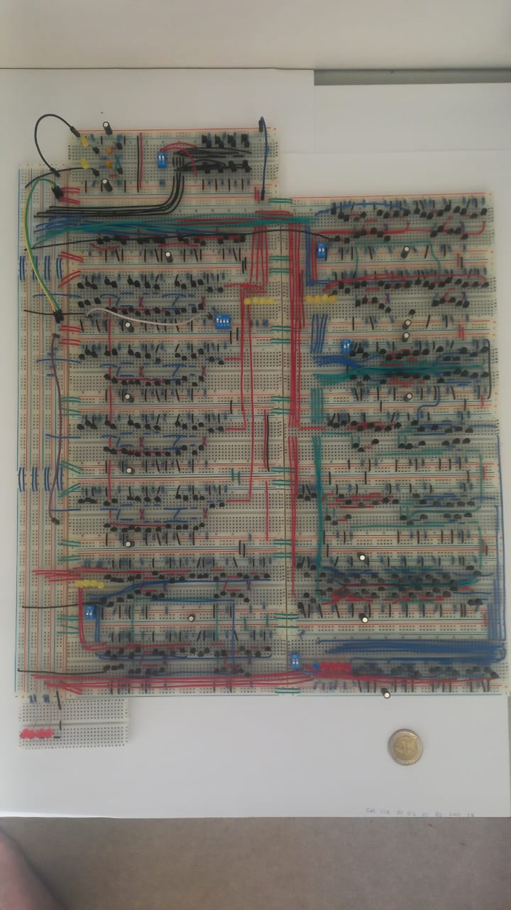

## The Final Product

 > ### Error Log:  The Final ALU drained my 10,000mAh power bank extremely fast
>
> **Issue:** The ALU drained the power bank very fast (Extremely fast, it drained the 10,000mAh powerbank by like a percentage every second. Interestingly enough the breadboards didn't melt when this was observed - I crudely calculated it as 10A current draw, which is probably not right). Maybe there was just a big initial voltage drop in the Power Bank and the internal computer on Power Bank linearly decreased the percentage counter to match the big initial voltage drop when connected to the ALU).
> **Solution:** This was solved by adding more connections to ground. The final current draw was under 1.5A.
---

  

### Reflection & Engineering Takeaways

Building a functional Arithmetic Logic Unit entirely from discrete BJT components provided a rigorous, ground-up perspective on the physical and electrical realities that abstract digital schematics conceal.

* **Physical Limits of Solderless Breadboards:** I realized the physical limitations of the cheap $1 breadboards I used In building the ALU. Solderless breadboards introduce contact resistance (high resistance mechanical terminations) and stray capacitance between adjacent strips. Across hundreds of connections this parasitic elements quickly multiplies. Some of these parasitic elements were mitigated.
* **Power Integrity and Ground Bounce:** Static power dissipation quickly escalated with the use of interconnected breadboards (something which in simulations doesnt always show up, at least LTSpice doesn't take this into account). Numerous problems came about when not enough ground connections were made (Which explains why PCBs have an entire layer just for ground to prevent these errors I perceived with my ALU). The importance of the type of connections to use when building a big circuit was observed. Originally I daisy-chained my breadboards, but quickly realized that a Start topology is the most effective for the power rails. The effects of decoupling capacitors were also perceived in ensuring spikes in system doesn't disrupt the signals. The timing of signals (especially with clock-sensitive signals) had to be managed.
* **Bus Architecture and Tri-State Buffering**: Managing shared interconnects highlighted the critical need for a disciplined bus topology. Relying on an active-low, open-collector bus paired with passive pull-up resistors eliminated destructive contention, but it also demanded careful driver selection. Using the correct tri-state buffer topology was vital.
* **Scope and Architectural Pragmatism:** The initial ambition was to make a fully Turing-complete 4-Bit computer (made entirely out of discrete components) that had a custom rule set and opcodes. However the problems perceived when building the ALU  highlighted the law of diminishing returns when scaling the solderless architecture. The project was instead scoped to deliver a robust, fully verified 4-Bit ALU that didn't comprimise signal integrity.
* **Theory vs. Hardware Realities:** Building this discrete implementation of a ALU bridged the gap between idealized Boolean algebra (and simulations) and solid-state device physics. In the future it seems obvious to make a HDL implementation of my original ambition of a 4-Bit Computer (maybe even more bits).

