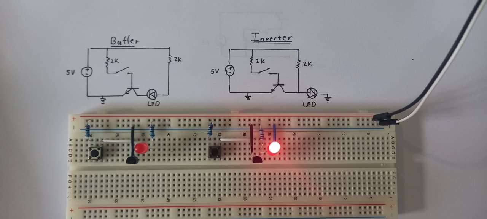
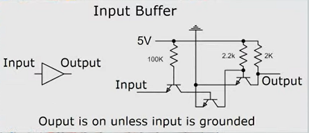
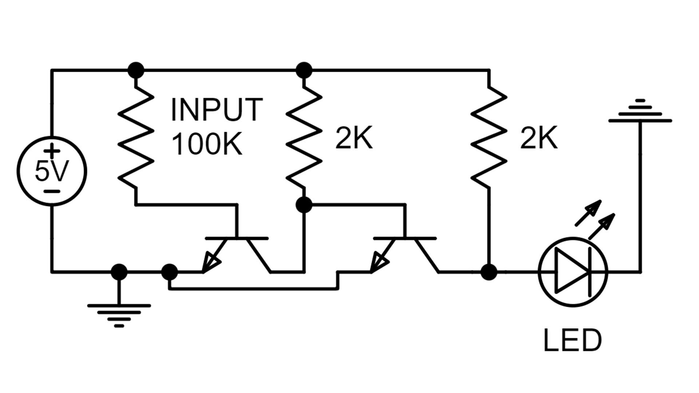
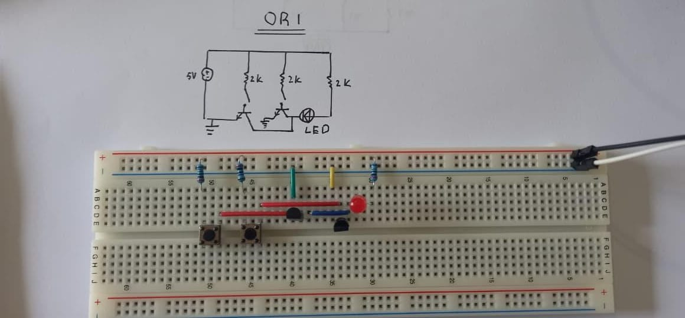
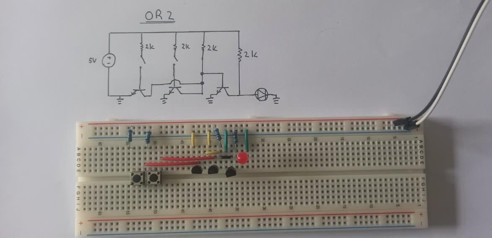
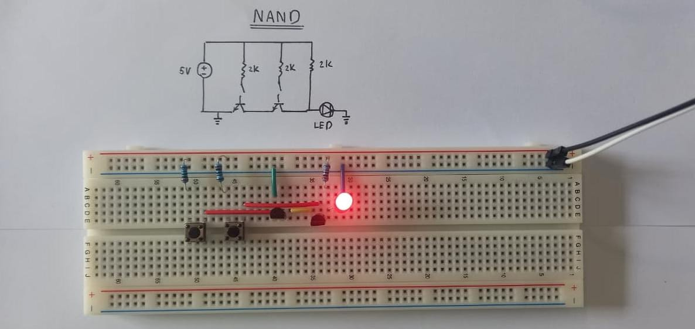

## Buffer and Inverter

- Buffer reoutputs a clean, strong singal. This is used when signal start to get weak or is heavily loaded.

- **The Problem:** The data bus is "weak." It relies on pull-up resistors to hold the voltage at 5V. If you connect the bus directly to a complex circuit like the ALU, the ALU draws so much current that it sucks the voltage down (e.g., to 2.5V).
    
- **The Buffer's Job:** It acts as a **Power Amplifier**. It gently "tastes" the weak bus voltage (High Impedance) and uses its own direct connection to the battery to blast a strong, high-current copy of that signal into the ALU.

### Buffer 2

---

### OR GATE

| A   | B   | Output |
| --- | --- | ------ |
| 0   | 0   | 0      |
| 0   | 1   | 1      |
| 1   | 0   | 1      |
| 1   | 1   | 1      |

- Notice that there are two OR gates shown. Number 1 looks simpler but OR gate number 2 is much more useful\l when using it in tangent with other logic gates( when other logic gates connected to it)
- Notice in OR 2 the LED's cathode is directly connected in ground, while in OR 1 the cathode is connected to the collector of the transistor, this characteristic is show with all the other gates since with OR gate 2, one can easiliy connect it to the input of another logic gate.

---
### NAND GATE

| A   | B   | Output |
| --- | --- | ------ |
| 0   | 0   | 1      |
| 0   | 1   | 1      |
| 1   | 0   | 1      |
| 1   | 1   | 0      |

---
### NAND GATE 

| A   | B   | Output |
| --- | --- | ------ |
| 0   | 0   | 0      |
| 0   | 1   | 0      |
| 1   | 0   | 0      |
| 1   | 1   | 1      |

