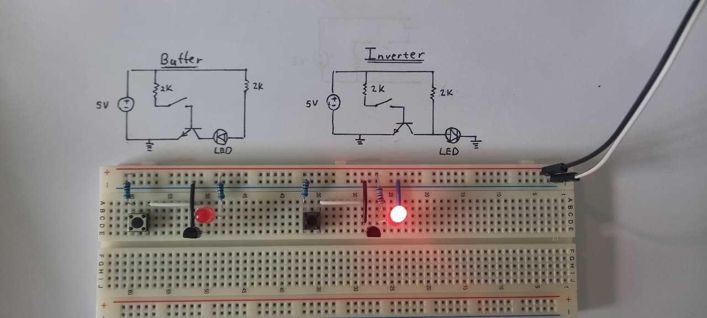
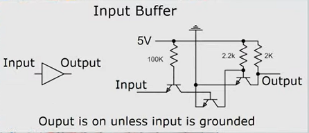
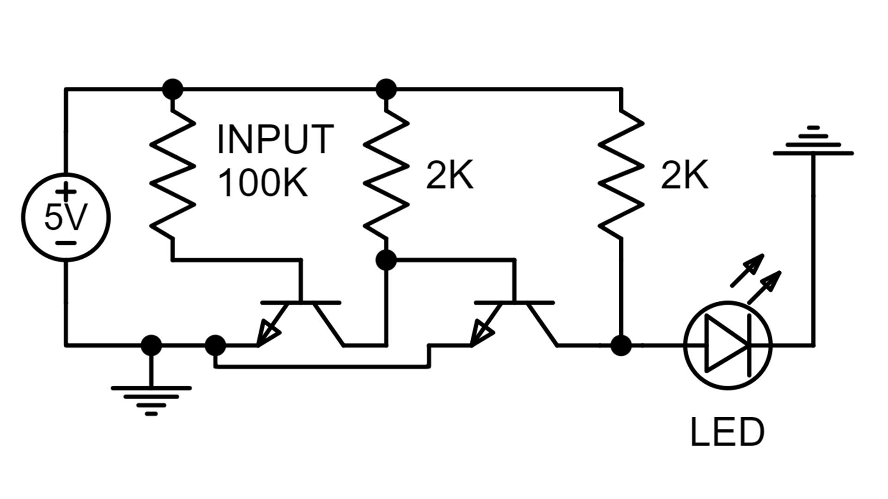
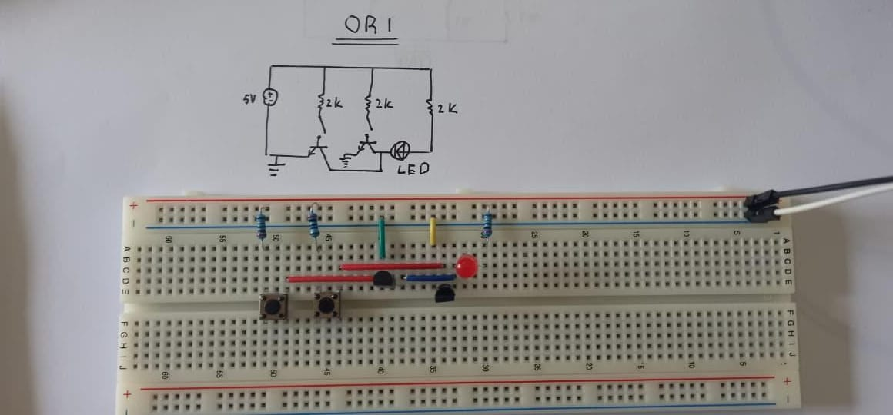
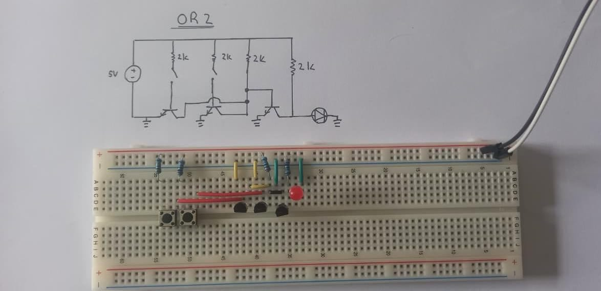
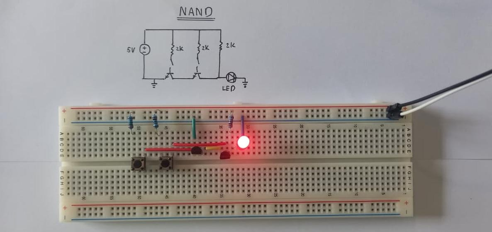
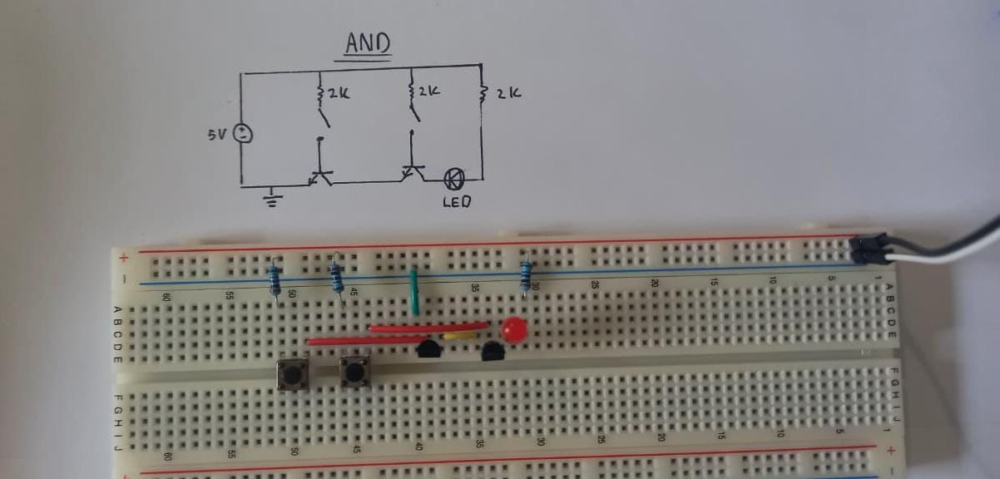
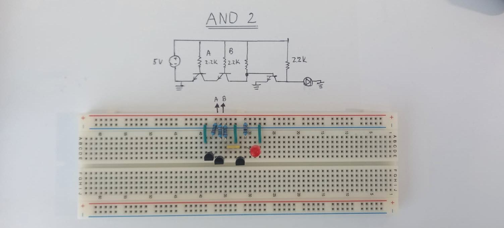
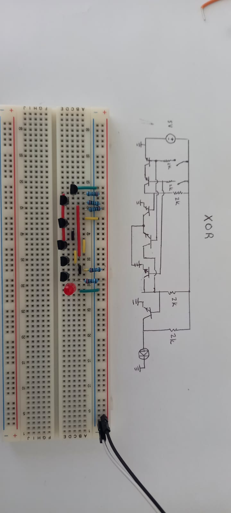
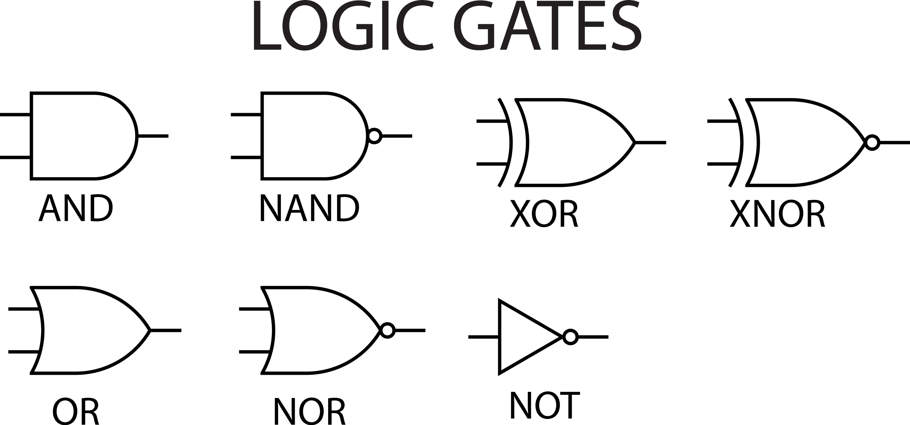

## Buffer and Inverter

Buffer re-outputs a clean, strong signal. This is used when signals start to get weak or is heavily loaded. Wires (especially jumper cables) induce parasitic capacitance that rounds the square waves. Buffers restore this since it uses its own $V_{CC}$ and ground rails to source or sink current. This can be mathimatically represented as follows:

$$A = A$$

One also gets Tri-state buffers (which will be looked at in a later section), that is used to prevent circuits from shorting when interconnected i.e. connected on a bus.

### Buffer 2
   

Buffers can be created by connecting two inverters in series.

---

### OR GATE

| A   | B   | Output |
| --- | --- | ------ |
| 0   | 0   | 0      |
| 0   | 1   | 1      |
| 1   | 0   | 1      |
| 1   | 1   | 1      |

- Notice that there are two OR gates shown. Number 1 looks simpler but OR gate number 2 is much more useful\l when using it in tangent with other logic gates( when other logic gates connected to it)
- Notice in OR 2 the LED's cathode is directly connected in ground, while in OR 1 the cathode is connected to the collector of the transistor, this characteristic is show with all the other gates since with OR gate 2, one can easiliy connect it to the input of another logic gate.

---
### NAND GATE

| A   | B   | Output |
| --- | --- | ------ |
| 0   | 0   | 1      |
| 0   | 1   | 1      |
| 1   | 0   | 1      |
| 1   | 1   | 0      |

- A NAND gate can be used to create any other type of logic gate, combinde wit hthe fact that it only takes 2 transistors to built, most of the computer ( and most modern computer) consists entirely of NAND gate.
---
### AND GATE 

| A   | B   | Output |
| --- | --- | ------ |
| 0   | 0   | 0      |
| 0   | 1   | 0      |
| 1   | 0   | 0      |
| 1   | 1   | 1      |

---
### XOR GATE
_Description: Crucial for the Adder circuit. Built using 6 transistors._

|  A  |  B  | Output |
| :-: | :-: | :----: |
|  0  |  0  |   0    |
|  0  |  1  |   1    |
|  1  |  0  |   1    |
|  1  |  1  |   0    |

- With this Gate swwitches were not included, rather resistors were used to act as the input switches(ones simply removes thh resistors to "turn off" the switch) I did not include switches for this one. Pulling out the 2 resistors furhest to the left acts as the switch)

The next section details the Adder building process and assembly

➡️ [The Adder](docs/The_Adder.md)

---

