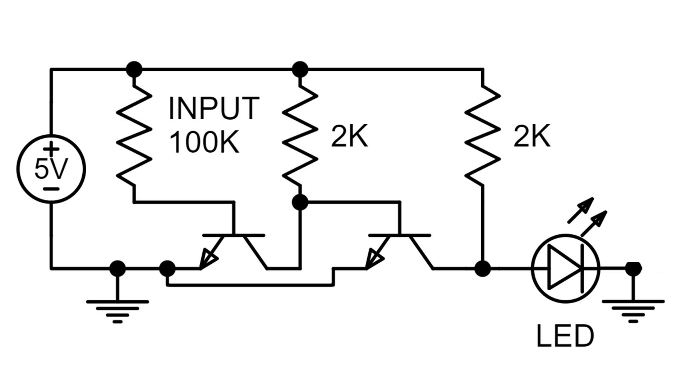
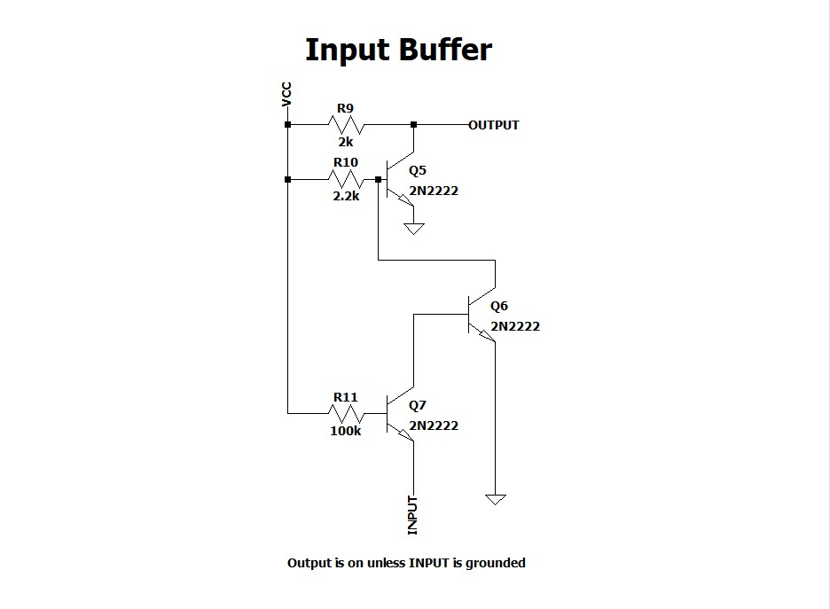
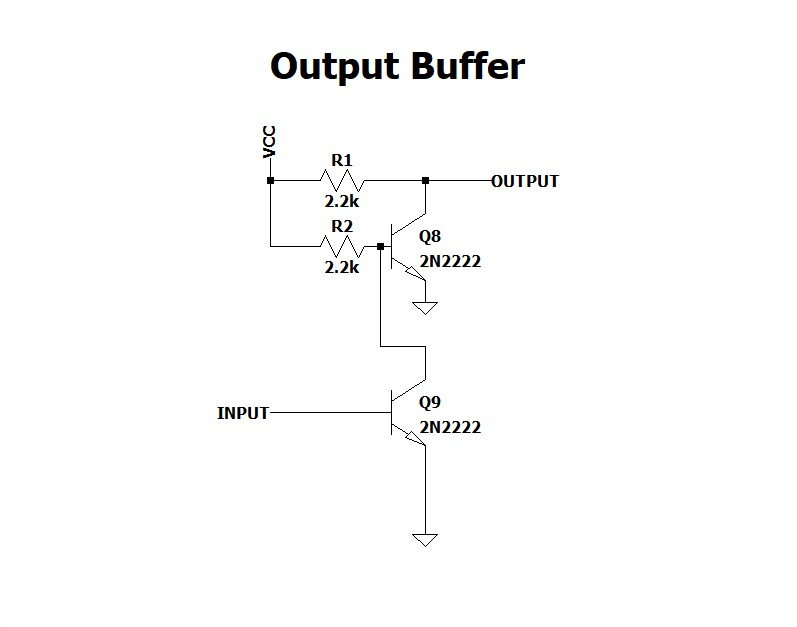
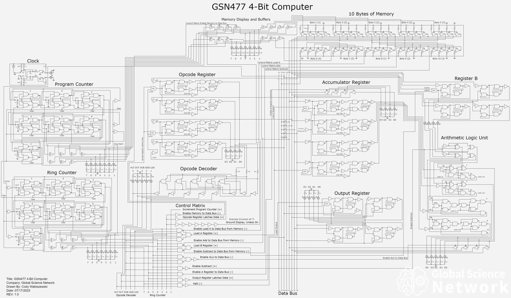

## Symbols for Logic Gates

  

---

### Buffer and Inverter

Buffer re-outputs a clean, strong signal. This is used when signals start to get weak or is heavily loaded. Wires (especially jumper cables) induce parasitic capacitance that rounds the square wave signals. Buffers restore this since it uses its own $V_{CC}$ and ground rails to source or sink current. The Buffer can be mathematically represented as follows:

$$A = A$$

An Inverter simply turns a `ON` (1) to a `OFF` (0) and vice versa (equivalent to the NOT operation)

  

One also gets Tri-state buffers (which will be looked at in a later section), that is used to prevent circuits from shorting when interconnected i.e. connected on a bus.

### Buffers used in the ALU
   
<!-- 

  

 -->

  

  

Buffers can also be created by connecting two inverters in series.

| Feature | Input Buffer (3 Transistors) | Output Buffer (2 Transistors) |
| :--- | :--- | :--- |
| **Input Connection** | Connects to the emitter of $Q_7$. | Connects to the base of $Q_9$. |
| **Output State When Input is Actively Driven** | **Low ($0\text{ V}$):** When input is actively pulled to Ground ($0\text{ V}$). | **High ($5\text{ V}$):** When input is actively driven with $+5\text{ V}$. |
| **Output State When Input is Disconnected / Not Grounded** | **Deterministic High ($5\text{ V}$):** When left floating or pulled high, output defaults cleanly to $5\text{ V}$. | **Undefined / Low ($0\text{ V}$):** With no input drive, base floats; output remains low (fluctuates if noise couples to the base). |
| **Primary Architectural Role** | **Input Buffer:** Interfacing to open-collector shared bus lines. | **Output / Display Buffer:** Isolating an internal latch node to drive an indicator LED. |

---

### OR GATE

| A   | B   | Output |
| --- | --- | ------ |
| 0   | 0   | 0      |
| 0   | 1   | 1      |
| 1   | 0   | 1      |
| 1   | 1   | 1      |

An OR Gate can be mathematically represented as follows:

$$\text{Output} = A+B$$

  

  

- Notice that there are two OR gates shown. Number 1 looks simpler (uses less transistors) but OR gate number 2 is much more useful when using it in tangent with other logic gates (when other logic gates are connected to it)
- Notice in OR 2 the LED's cathode is directly connected in ground, while in OR 1 the cathode is connected to the collector of the transistor, this characteristic is show with all the other gates since with OR gate 2, one can easiliy connect it to the input of another logic gate.
---
### AND GATE 

| A   | B   | Output |
| --- | --- | ------ |
| 0   | 0   | 0      |
| 0   | 1   | 0      |
| 1   | 0   | 0      |
| 1   | 1   | 1      |

Outputs a logic high only when all inputs are high, implemented here using series-connected transistors to gate the output line.

$$\text{Output} = A \cdot B$$

  

  

---
### NAND GATE

| A   | B   | Output |
| --- | --- | ------ |
| 0   | 0   | 1      |
| 0   | 1   | 1      |
| 1   | 0   | 1      |
| 1   | 1   | 0      |
- A NAND Gate is an inverted AND gate. It is mathematically represent as:

$$(A \cdot B)'$$

- A NAND gate can be used to create any other type of logic gate, combined with the fact that it only takes 2 transistors to built, most of the computer ( and most modern computer) consists entirely of NAND gate.

  

De Morgan's Laws provide the mathematical bridge that explains how a NAND gate converts into other operations (like OR and NOR):

$$ (A \cdot B)' = A' + B'$$

$$ (A + B)' = A' \cdot B'$$

Using this property it is possibly to synthesis any gate. While using only NAND Gate can be effective, it can increase logic depth (increase the critical path). This needs to be taken into consideration where it is applicable.

---
### XOR GATE
_Description: Crucial for the Adder circuit. Built using 6 transistors._

|  A  |  B  | Output |
| :-: | :-: | :----: |
|  0  |  0  |   0    |
|  0  |  1  |   1    |
|  1  |  0  |   1    |
|  1  |  1  |   0    |

  

$$\text{Output} = A \oplus B = A'B + AB'$$

* **Test Configuration:** Pulling the two leftmost pull-down/bias resistors acts as the active input toggle in place of mechanical switches.

Depicted above is the circuit schematic by Cody Wabiszewski. The build documented in this Workbook focusses on the right part of the schematic (the ALU).

The next section details the Adder building process and assembly.

➡️ [The Adder](../docs/The_Adder.md)

---

