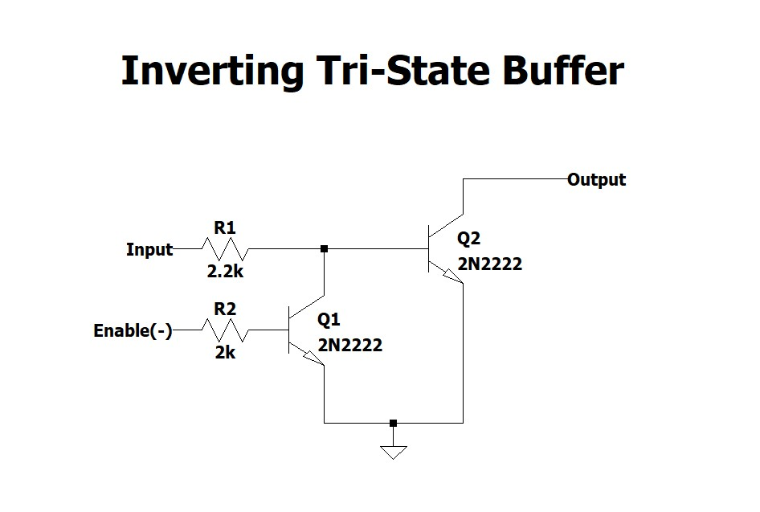
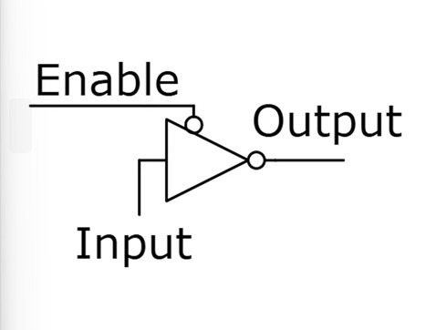
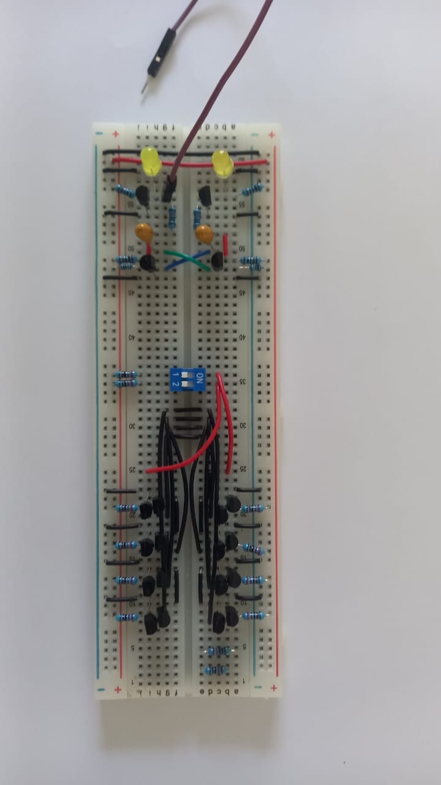

## Memory

The primary internal memory stage provides two 4-bit storage locations (Nibble 0 and Nibble 1), organized to supply immediate data and instructions directly to the system data bus.

The memory block is partitioned into two independently addressable 4-bit nibbles:

  

  

To prevent bus contention on the shared 4-bit data bus, memory nibbles interface with the lines using "active-low, inverting open-collector tri-state buffers".

### Buffer Terminal Characteristics:

* **Active-Low Enable ($\overline{\text{Enable}}$):** Driven low ($0\text{ V}$) to assert the nibble onto the bus, and pulled high ($5\text{ V}$) to disconnect.
* **Inverting Data Path:** The output is inverted
* **Open-Collector Output:**
  * When disabled ($\overline{\text{Enable}} = 1$), the output transistor is placed into cutoff, presenting a high-impedance (**High-Z**) state that releases the bus.
  * When enabled ($\overline{\text{Enable}} = 0$), the buffer sinks current to Ground (**Logic 0**) or floats the line (**Logic 1** via the external bus pull-up resistor).

---

## 3. Truth Table & Bus Drive States

| $\overline{\text{Enable}}$ Line | Stored Bit ($D_{\text{in}}$) | Buffer Output State | Bus Line Voltage ($V_{\text{BUS}}$) | Resulting Bus Logic | Mode |
| :---: | :---: | :---: | :---: | :---: | :--- |
| **$5\text{ V}$ (Disabled)** | X | Cutoff (High-Z) | $5.0\text{ V}$ | *Released* | Disconnected; bus freed for other modules |
| **$0\text{ V}$ (Enabled)** | **$0\text{ V}$ (Low)** | Cutoff (High-Z) | $5.0\text{ V}$ | **Logic 1** | Inverted Output (Bus pull-up pulls high) |
| **$0\text{ V}$ (Enabled)** | **$5\text{ V}$ (High)** | Saturated to GND | $\approx 16.9\text{ mV}$ | **Logic 0** | Inverted Output (Actively shunted to ground) |

  

