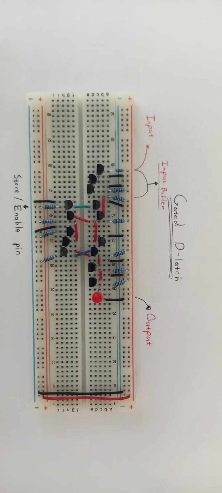
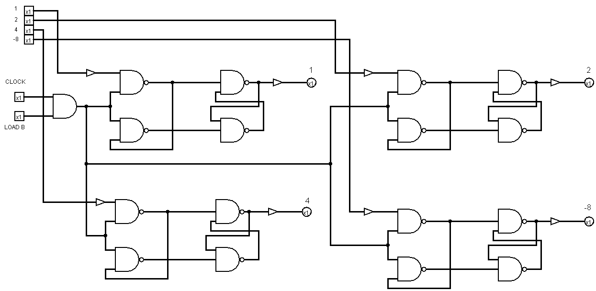

  https://www.youtube.com/watch?v=jpe3DGVITvk&list=PL52rQn9fkWwNrZ2wSoO962_7hmBCqOrUZ&index=7

  

   > [!example]- Log: Light always on on the register (9 Dec)
>
> **Issue:** The jumper wire that goes fro mthe output of one nand gate to the input of the other didn't make a good connection, there was no continuiity
> > **Issue 2:** Same thing happened again. i accidently grounded the base of the transistors 

 > [!example]- Unable to store a 1, can only store a 0 correctly (9 Dec)
>
> **Issue:**  I use two types of transistors in this computer. Ones brought from RS Components ( High A grade). And ones from Temu (grade c). Although the gain of the two transistors are the same. The switching speed of the higher quality one is faster. I used a cheap one with the nand gates in the d latch. This cuased it to not be able to store a 1(it defualt to off). When i switched the transistors indicated in the schetck below, it correctly stored the values. One can use the ring i=occilator test to test the speed of transistors. Since i dont have an oscilloscope to read the frequeancy, i can either read the amount of current used by system, or use an arduino that has a frequancy pin and library that can complete the same task as the oscilloscope

-Now that the latches are connected toegethe im getting issues with output, it looks like if i use the cheap,slow transistors as the enable transistors, the latchs works proberly, however,ironically, if i use the more expensive ones at the enable pins, in tansint with the other cheaps ones it doesn;t work.
### The Physics: Inductive Kickback ($V = L \cdot \frac{di}{dt}$)

- **The Breadboard:** Your Enable line is a long wire connecting 4 latches. Long wires have **Inductance** ($L$).
- **The "Temu" Transistor (Slow):** It turns on lazily (e.g., in 50 nanoseconds). The current ramps up smoothly. The inductance doesn't mind.
- **The "High Quality" Transistor (Fast):** It snaps ON instantly (e.g., in 5 nanoseconds).
    
    - **The Equation:** A massive change in current ($di$) in a tiny time ($dt$) creates a **Voltage Spike**.

    - **The Result (Ringing):** The voltage on the Enable line bounces violently (e.g., 5V $\to$ 0V $\to$ 2
    - **The Crash:** The latches see this bounce as "Enable... Disable... Enable...". They get confused and latch garbage data.

Conpclusion: I have to be consistent where and i use what braand of transistor to ensure reliability..

The "Ring Oscillator" Test transistors

https://hackaday.io/project/184912-8-bit-transistor-computer/log/205741-gates-ring-oscillator-speed-tests

### 1. The Component: Gated D-Latch

- **Type:** Level-Triggered D-Latch (also known as a "Transparent Latch").
- **Why:** It is simpler and uses fewer transistors  than the Master-Slave Flip-Flops used in the Accumulator. Since these registers load stable data from the bus and don't feed back into themselves immediately, this simpler design is safe.

### 2. The Control Logic: The "AND" Gate

You do not connect the Clock directly to the Latch. You use a "Gatekeeper" circuit to ensure the register only updates when you want it to.

- **The Circuit:** A single **2-Input AND Gate**.
- **Input A:** `System Clock` (The heartbeat).
- **Input B:** `Load Enable` (The specific command wire, e.g., "Load Reg B").
- **Output:** Goes to the **Enable/G** pins of all 4 bits in the register.

  
  ---
  ### Output Register
  
  
