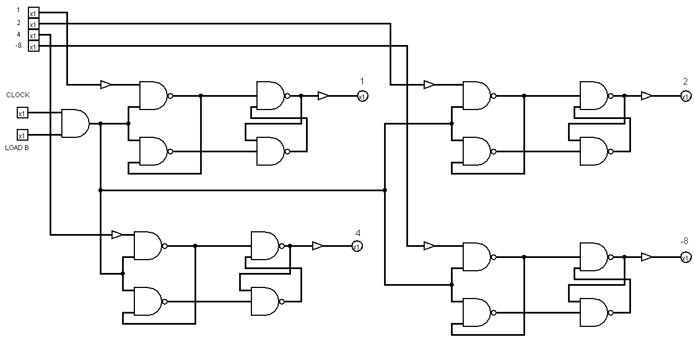
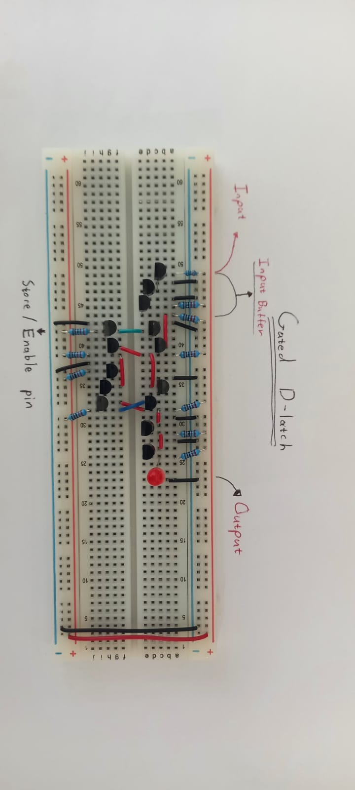
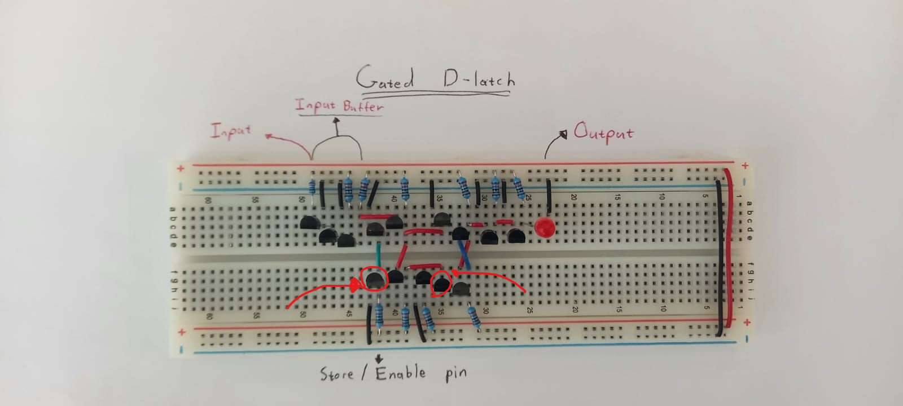
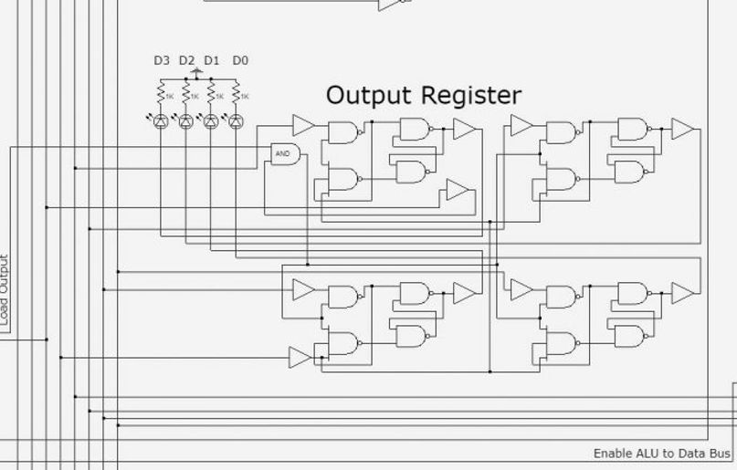
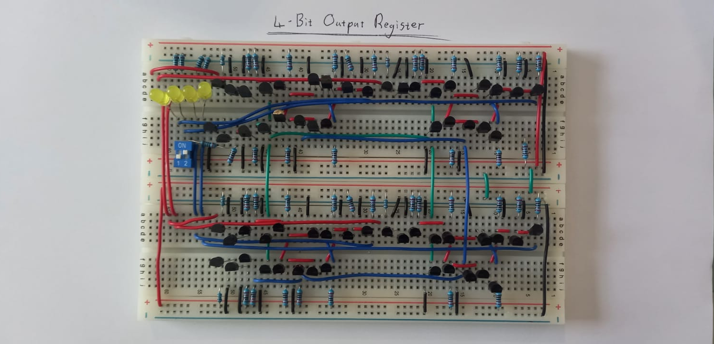
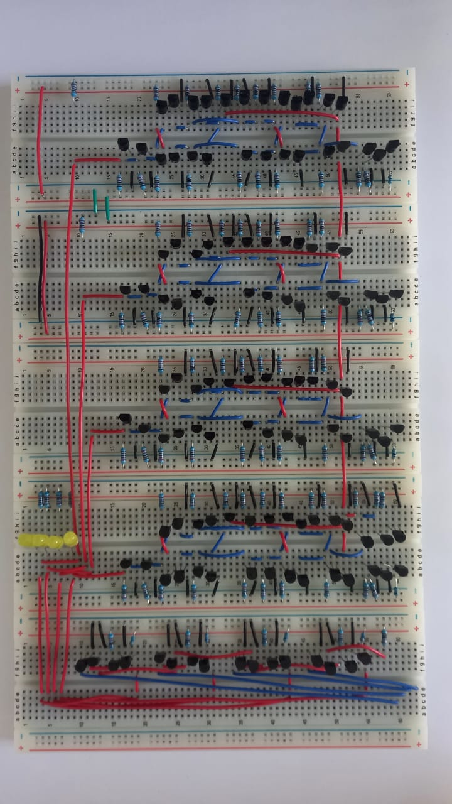

## Registers / Gated D-Latch

Each register bit consists of four discrete NAND gates configured as a level-triggered (transparent) storage cell, preceded by an input buffer and terminated with an output inverter.

This component is known as a Gated D-Latch. Here is breakdown of the component:
- **Enable/Clock (The middle input):** The lien that splits and feeds two NAND gates. When this signal is `ON` (1), the latch is "transparent" and accepts new data. When it is `OFF` (0), the latch ignores new data and holds its current state
- **Data(Top Input):** The signal we want to store.
- **Left side NANDs:** The two NAND gates on the left control the inputs to the memory element. Notice how the top-left NAND output feeds directly into the input of the bottom-left NAND: this is a cost effective way to get an inverted output, instead of traditionally building it with an inverter (If you search on Google "D-latch", you will see it traditionally build with a inverter), this is because if clock is High, the output of NAND gate is just the inversion of our `DATA` input The inverted input ensures the memory element never receive the invalid command "SET = `0` & RESET = `0`" which causes a race condition.
-**The Memory Element (Right Side):** The two cross coupled NAND gates form a SR-Latch. This is the part that actually remembers the stored bit.

This video [Latches and Flip-flops](https://www.youtube.com/watch?v=y7Zf7Bv_J74) explains the Gated D-latch wonderfully.

  

 

  

> ### Error Log: Light always on on the register 
>
> **Issue:** The jumper wire that goes from the output of one NAND gate to the input of the other NAND didn't make a good connection, there was no continuity

> ### Error Log: Unable to store a 1, can only store a 0 correctly
>
> **Issue:**  I use two types of transistors in this computer. Ones brought from RS Components (High A grade). And ones from Temu (grade C). Although the gain of the two transistors are the same. The switching speed of the higher quality one is faster. I used a cheap transistor with the NAND gates in the D latch. This caused it to not be able to store a 1 (it defualtED to `OFF`). When I switched the transistors indicated in the sketch below, it correctly stored the values. One can use the ring i=occilator test to test the speed of transistors. Since i dont have an oscilloscope to read the frequeancy, i can either read the amount of current used by system, or use an arduino that has a frequancy pin and library that can complete the same task as the oscilloscope

### Log Entry 2: Asymmetric Logic Storage & Transistor Slew Rates
* **Date:** 9 December
* **Symptom:** The latch successfully held a logic `0`, but failed to store a logic `1` (consistently defaulting to `0` upon clock deassertion).
* **Root Cause (Propagation Delay & Slew Mismatch):** 
  The circuit combined two different transistor batches:
  * Grade A (RS Components): High $h_{\text{FE}}$, fast switching transition times ($t_r, t_f \approx 5\text{ ns}$).
  * Grade C (Temu): Comparable DC current gain, but slower switching transitions ($t_r, t_f \approx 50\text{ ns}$) due to larger junction capacitance ($C_{\text{be}}, C_{\text{bc}}$).

  Placing slow transistors in the feedback NAND path created asymmetric internal propagation delays. When attempting to latch a `1`, the slower gate could not settle before the enable line decayed, causing the latch to collapse to its default low state.
* **Resolution:** Grouped matched, high-speed transistors exclusively within the internal bistable feedback loop.

  

-Now that the latches are connected toegethe im getting issues with output, it looks like if i use the cheap,slow transistors as the enable transistors, the latchs works proberly, however,ironically, if i use the more expensive ones at the enable pins, in tansint with the other cheaps ones it doesn;t work.
### The Physics: Inductive Kickback ($V = L \cdot \frac{di}{dt}$)

- **The Breadboard:** Your Enable line is a long wire connecting 4 latches. Long wires have **Inductance** ($L$).
- **The "Temu" Transistor (Slow):** It turns on lazily (e.g., in 50 nanoseconds). The current ramps up smoothly. The inductance doesn't mind.
- **The "High Quality" Transistor (Fast):** It snaps ON instantly (e.g., in 5 nanoseconds).
    
    - **The Equation:** A massive change in current ($di$) in a tiny time ($dt$) creates a **Voltage Spike**.

    - **The Result (Ringing):** The voltage on the Enable line bounces violently (e.g., 5V $\to$ 0V $\to$ 2
    - **The Crash:** The latches see this bounce as "Enable... Disable... Enable...". They get confused and latch garbage data.

Conpclusion: I have to be consistent where and i use what braand of transistor to ensure reliability..

The "Ring Oscillator" Test transistors

https://hackaday.io/project/184912-8-bit-transistor-computer/log/205741-gates-ring-oscillator-speed-tests

### 1. The Component: Gated D-Latch

- **Type:** Level-Triggered D-Latch (also known as a "Transparent Latch").
- **Why:** It is simpler and uses fewer transistors  than the Master-Slave Flip-Flops used in the Accumulator. Since these registers load stable data from the bus and don't feed back into themselves immediately, this simpler design is safe.

### 2. The Control Logic: The "AND" Gate

You do not connect the Clock directly to the Latch. You use a "Gatekeeper" circuit to ensure the register only updates when you want it to.

- **The Circuit:** A single **2-Input AND Gate**.
- **Input A:** `System Clock` (The heartbeat).
- **Input B:** `Load Enable` (The specific command wire, e.g., "Load Reg B").
- **Output:** Goes to the **Enable/G** pins of all 4 bits in the register.

  
  ---
  ### Output Register
  
  
   > [!example]- Bit 4 always stayed on (Des 15)
>
> **Issue:**  resistor was loose, so a new resistor was placed and this fixed the issue---

 
 ---
 ## Accumalator Register
  

  *   ➡️ **[Clock](../docs/Clock.md):**
---

  
