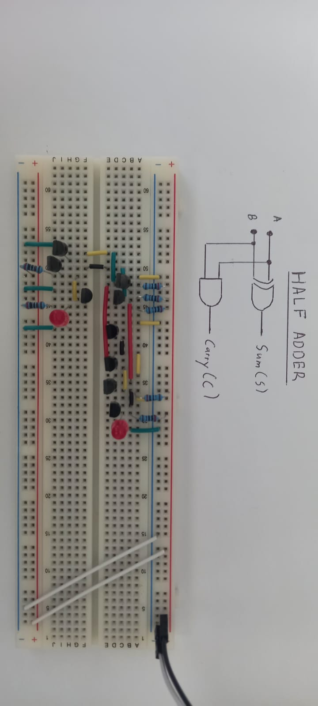

## Combinational Logic: The ALU (Arithmetic Logic Unit)

*The ALU is the calculator part of the computer. It performs math and logic operations on two 4-bit inputs.*

###  The Half Adder

Combining an XOR and an AND gate to add two bits. 

|  A  |  B  | Sum (S) | Carry (C) |
| :-: | :-: | :-----: | :-------: |
|  0  |  0  |    0    |     0     |
|  0  |  1  |    1    |     0     |
|  1  |  0  |    1    |     0     |
|  1  |  1  |    0    |     1     |

---
## The Full Adder (1-Bit)

Chaining two half-adders to handle a Carry-In bit.

- **Transistor Count:** [e.g., 21 transistors]
    
- **Testing:** Verified that $1 + 1 + 1 = 11_2$ (Sum 1, Carry 1).
- 
| **Input A** | **Input B** | **Carry In (Cin​)** | **Sum (S)** | **Carry Out (Cout​)** |
| ----------- | ----------- | ------------------- | ----------- | --------------------- |
| 0           | 0           | 0                   | **0**       | **0**                 |
| 0           | 0           | 1                   | **1**       | **0**                 |
| 0           | 1           | 0                   | **1**       | **0**                 |
| 0           | 1           | 1                   | **0**       | **1**                 |
| 1           | 0           | 0                   | **1**       | **0**                 |
| 1           | 0           | 1                   | **0**       | **1**                 |
| 1           | 1           | 0                   | **0**       | **1**                 |
| 1           | 1           | 1                   | **1**       | **1**                 |

- The first circuit is a Full adder made of 2 half-adders and an or-gate
	- The second circuit is a Full-Adder made only from Nand gates. This one is more compact to build on a breadboard (As each nand gate is just 2 transistors next to each other.)
- *0.6-0.7V* was send if inputs was 1 for the second half-adders And gate.
- Requires 21 transistors.
