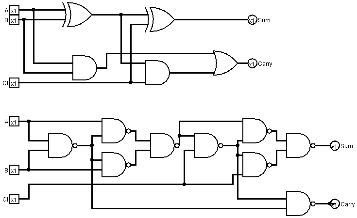
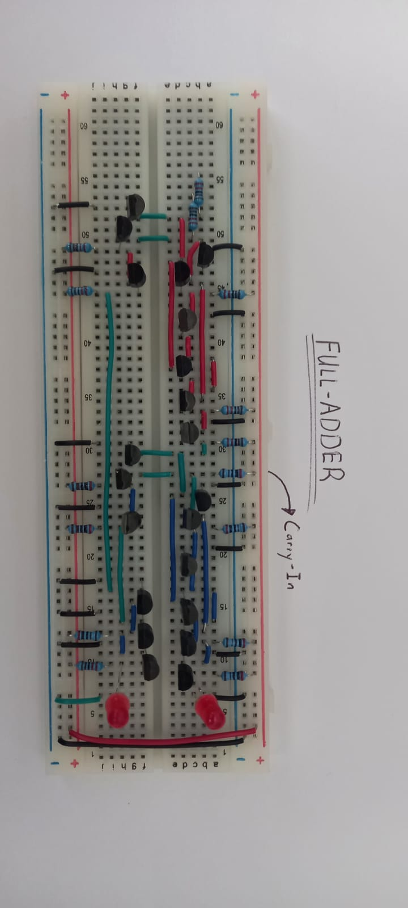

## Combinational Logic: The ALU (Arithmetic Logic Unit)

*The ALU is the calculator part of the computer. It performs math and logic operations on two 4-bit inputs.*

###  The Half Adder

Combining an XOR and an AND gate to add two bits. 

|  A  |  B  | Sum (S) | Carry (C) |
| :-: | :-: | :-----: | :-------: |
|  0  |  0  |    0    |     0     |
|  0  |  1  |    1    |     0     |
|  1  |  0  |    1    |     0     |
|  1  |  1  |    0    |     1     |

---
## The Full Adder (1-Bit)

Chaining two half-adders to handle a Carry-In bit.

- **Transistor Count:** [e.g., 21 transistors]
    
- **Testing:** Verified that $1 + 1 + 1 = 11_2$ (Sum 1, Carry 1).

| **Input A** | **Input B** | **Carry In (Cin​)** | **Sum (S)** | **Carry Out (Cout​)** |
| ----------- | ----------- | ------------------- | ----------- | --------------------- |
| 0           | 0           | 0                   | **0**       | **0**                 |
| 0           | 0           | 1                   | **1**       | **0**                 |
| 0           | 1           | 0                   | **1**       | **0**                 |
| 0           | 1           | 1                   | **0**       | **1**                 |
| 1           | 0           | 0                   | **1**       | **0**                 |
| 1           | 0           | 1                   | **0**       | **1**                 |
| 1           | 1           | 0                   | **0**       | **1**                 |
| 1           | 1           | 1                   | **1**       | **1**                 |

- The first circuit is a Full adder made of 2 half-adders and an or-gate
	- The second circuit is a Full-Adder made only from Nand gates. This one is more compact to build on a breadboard (As each nand gate is just 2 transistors next to each other.)
- *0.6-0.7V* was send if inputs was 1 for the second half-adders And gate.
- Requires 21 transistors.

	Full Adder Colours
> 
> - **Red:** First half-Adder logic gate
>     
> - **Black:** Connections to ground 
> - **Blue:** The second half-adder and the OR gate
>    
> - **Green:** Connects each logic gate to each other

> [!example]- Log: 2nd Adder Crisis (3 Dec)
> 
> Issue: Carry-out LED only sometimes lit up
> 
> Solution: The B input resistor did not make proper connection with ground and depending on if you touch board it will make contact

> [!example]- Log: NAND Adder Crisis (9 Dec)
> 
> Issue: Carry-out LED only sometimes lit up
> 
> Solution: The B input resistor did not make proper connection with ground and depending on if you touch board it will make contact

> [!example]- Log: Transistors turned upside down (7 Dec)
> 
>  Issue: Transistors were turned upside down for last nand full adder
> 
> Solution: Although it still worked correctely when turned upside down. I made sure emiiter was connected to ground as usually one side has more electron when building the transitors to allow the current to smoothly move from one direction to the other. Swapping it gives it another current gain, although very small.

  
