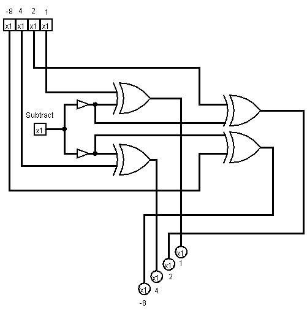
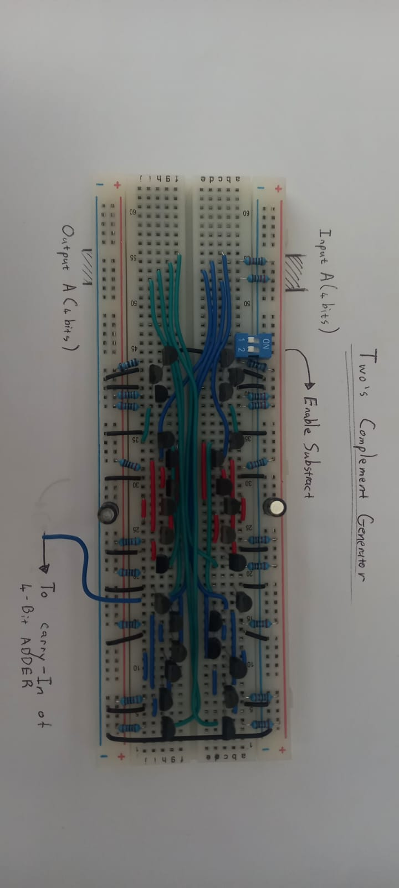
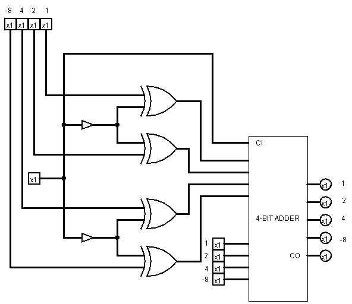
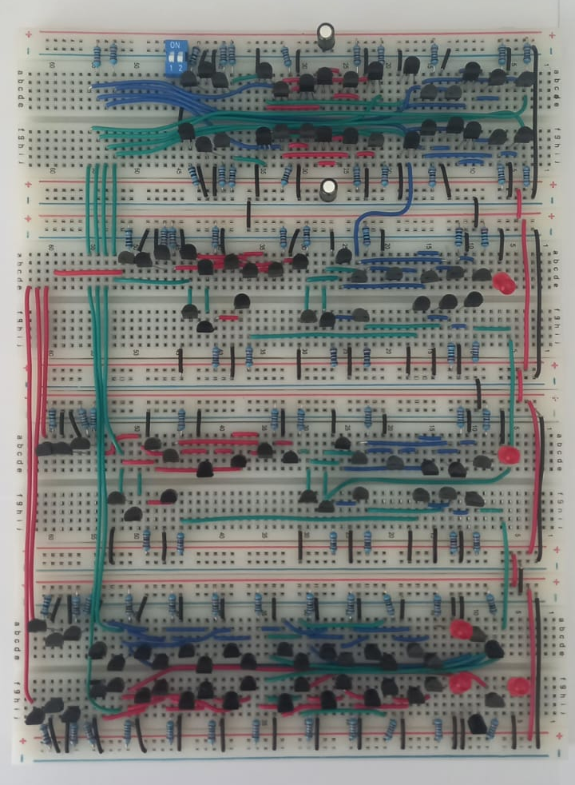

## Two's Complement Generator

- *The Concept: This is the mathematical rule: To make a number negative, invert all bits and add 1*
- The Hardware: Controlled Inverter (XOR Gates)

    - **Invert:** The **XOR gates** act as programmable inverters. When the `SUBTRACT` line is On, they flip the B-input bits.
        
    - **Add One:** The same `SUBTRACT` line connects to the **Carry-In** ($C_{in}$) of the first Adder. This adds the necessary "$+1$" to the calculation.
 
     

     

- Note that the Subtract input signal is divided into two input buffer to "divide and conquer". One input buffer drive bit 0 and 1. The other drives bit 2 and 3.
- The subtract input signal also goes to the carry in of the 4-bit adder. This acts as the "+1" operation of the Two's complement
      
      

- Stress testing the ALU with the calulation 0 - 1 = 15 shows that the ALU circuit draws roughly 100mA.
- With the bus and Tri state buffer it is 130 mA.
---
### Cause 1: Ground Loop Resistance (Ground Bounce)
- Enabling subtraction turns on **4 XOR gates + Carry-In logic** at once.
- This causes a sudden current surge flowing to ground.
- Breadboard grounds have **high resistance** due to unsoldered spring contacts.
- If only one thin jumper connects the ground rail, it behaves like a resistor.
- During the surge, the local ground rises , breaking logic thresholds.
- Daisy-chained breadboards worsen this: boards at the end receive weaker/shifted ground.(ground bounce)

### Solution 1: Improve Grounding ("Star Grounding")
- Use **multiple independent ground wires** to the main ground point.
- All the breadboards 5v and ground will be conected to the central bus
- Avoid daisy-chaining power rails between breadboards.

### Solution 2: Add Bypass Capacitors
- Place **100 nF** + **10 µF** capacitors across every breadboard's power rails.
- Acts as a local energy reservoir during current spikes.
- Example: Electrolytic 10 µF → long leg = 5 V, short leg = GND.

### Cause 2 (After Fixing Ground): Light Flicker
- After improving grounding, brief LED “sparks” occurs and then turn off.
- For a tiny fraction of a second (maybe microseconds), the computer is in a state of chaos.
- The electrical signals travel down the wire and hit the logic gates at different times.
- The **Carry-In** might turn ON before the **XOR gates** have finished inverting the inputs.
- This wrong calculation results in a "1" on an output wire that is supposed to be "0".
- Because the LED was only on for a microsecond, your eye registers it as a "dim spark" rather than a full brightness.

### References
- Breadboard stability: https://forum.digikey.com/t/breadboard-circuit-stability/36653  
- Ground bounce and logic hazards: https://www.analog.com/en/resources/analog-dialogue/studentzone/studentzone-march-2017.html

  
    
