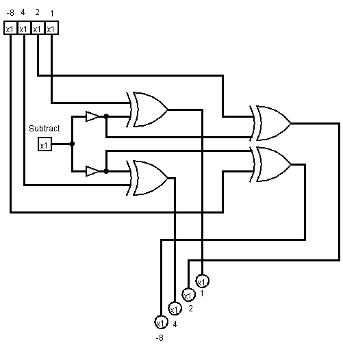
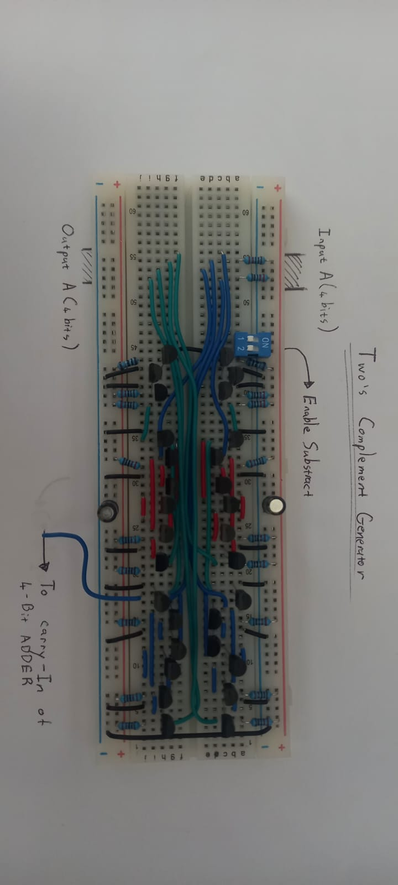
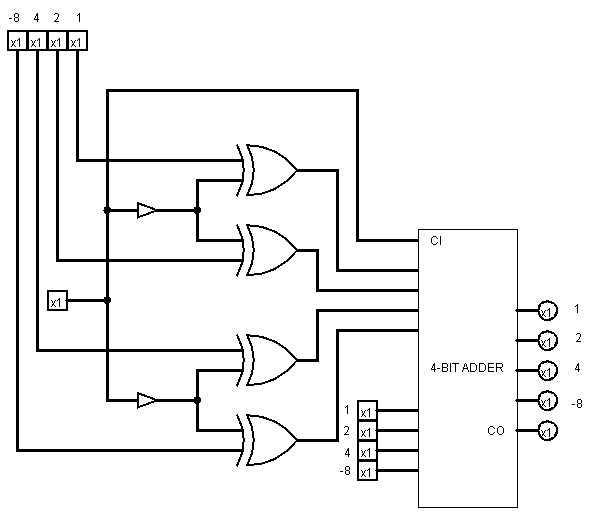
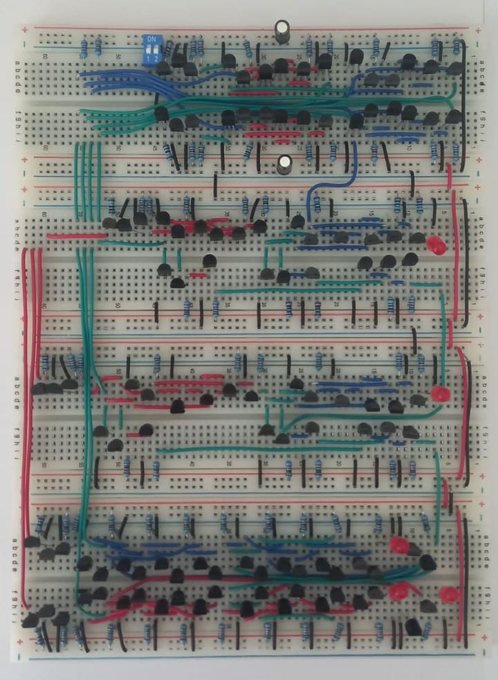

## Two's Complement Generator

- *The Concept: This is the mathematical rule: To make a number negative, invert all bits and add 1. The educational videos of [Sebastian Lague's Computer architecture series](https://youtu.be/QZwneRb-zqA?si=3GDSav75TmTZl-Wr),  were extremely helpfull in explaining this concept.*
- The Hardware: Controlled Inverter (XOR Gates)

    - **Invert:** The **XOR gates** act as programmable inverters. When the `SUBTRACT` line is On, they flip the B-input bits.
        
    - **Add One:** The same `SUBTRACT` line connects directly to the **Carry-In** ($C_{in}$) of the first Adder. This automatically adds the necessary $+1$ to complete the two's complement calculation.
 
     

  The four Binary inputs (From LSB to MSB) are labeled `-8,4,2,1` the XOR gates acts as the inverters.
  - When `Subtract` is OFF(0): Buffers send `0` to all the XOR gates. When a Data bit is XOR'ed with a `0`, it passes through completely unchanged ([Tabel of the XOR gate](Logic_Gates.md#xor-gate))
  - When `Subtract` is ON(1): The buffers send a `1` to all the XOR gates. When a data bit is XOR'ed with a '1', the bit is inverted( a `1` becomes a `0` and vice verse). This executes the first step of the two's complement generator.

     

- Note that the Subtract input signal is divided into two input buffer to "divide and conquer". One input buffer drive bit 0 and 1. The other drives bit 2 and 3.
- The subtract input signal also goes to the `Carry-In` of the 4-Bit Adder. This acts as the "+1" operation of the Two's complement ( The final operation, completing the two's complement generator)
      
      

- Stress testing the ALU with the calculation 0 - 1 = 15 shows that the ALU circuit draws roughly 100mA.
- With the Bus and Tri state buffer it is 130 mA.
---

>### Error Log: Subtract Signal Weakened (9 Dec)
>
> **Issue:** When enabling the XOR subtract signal the signal seems to get weakend. The output is wrong, unless I add more wires to connect the ground on the Subtract module.
>
> **Cause:** - Ground Bounce: Enabling `Subtract` "turns on/uses" 4 XOR gates and the carry in logic. This can potentially cause a sudden current surge flowing to ground. Breadboard grounds have a noticeable resistance due to unsoldered spring contacts, during the surge, the local ground can rise, breaking the logic threshold, which can explain the wrong output. Daisy chaining my breadboards (which I initially did) worsens this effect. 
>
>**Solution:** - Avoid Daisy chaining breadboards, do Star Grounding rather. I also added Bypass capacitors (100nF + 10µF) across the power rails. This acts as a local energy reservoir during current spikes. The 100nF (ceramic capacitors were used as ceramic capacitor are good with high frequencies) capacitors filter out the high frequency noise, while the 10 µF capacitors provide the bulk energy needed to stabilize longer voltage drops.

>### Error Log: Lights flicker on startup (9 Dec)
>
> **Issue:** When enabling power it seems all the light flicker for a split second.
>
> **Solution/Cause:** For tiny fraction of a second (maybe microseconds) the computer is in a state of chaos as the different paths of the ALU have different delays. Because it happens very fast our eyes register it as a quick flicker. This will not cause a problem, given that the clock period is longer than the the time the system is in a state of calculation/chaos. This is because the system captures the value solely on the clock edge, so it doesn't matter if its in chaos, aslong as at the clock edge 
the output is in a stable state/ displaying correct value to be captured.

### Research & References

- Due to the Fourier analysis, square waves/clock pulses carry odd harmonics that have very large frequencies, even though the circuit's clock runs at <5Hz. This essentially makes it a high-frequency circuit.
- Distributed/ parasitic capacitance and resistance acts as a low pass filter, rounding the square waves.
- Long wires can cause voltage spikes and even ground bounce, where the local ground shifts relative to true ground and trigger erratic logic states.
- Breadboard stability: https://forum.digikey.com/t/breadboard-circuit-stability/36653

- There is a fallacy of the ideal ground. In theory, ground is an ideal zero-impedance node where return currents cuase zero differential voltage ($\Delta V = 0$).
- In Pphysical circuits every return path cariies parasitic resistance (R) and Inductance (L) causing return currents to generate unwanted error voltages ( ($\Delta V = I R + L \frac{di}{dt}$) between different ground points.
- Ground bounce and logic hazards: https://www.analog.com/en/resources/analog-dialogue/studentzone/studentzone-march-2017.html
---

The next section details the ALU Tri-state buffer building process and assembly.
*   ➡️ **[ALU Tri-State Buffers](../docs/ALU_Tri_State_Buffers.md):**

  
    
